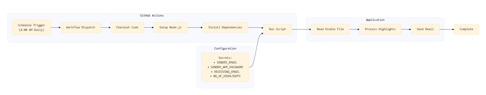

# kindle-reminder

📱 Your personal Kindle highlights companion - sending your favorite moments directly to your inbox

[](https://github.com/mushtaq96/kindle-reminder/actions)
[](https://opensource.org/licenses/MIT)

## What is it?

A privacy-focused service that delivers your Kindle highlights right to your email inbox. No third-party services, no data sharing - just your highlights, your way.

## Features

✨ **Privacy First**

- Your highlights stay private
- No external services involved
- Runs entirely on GitHub's infrastructure

📧 **Customizable Notifications**

- Choose your email frequency
- Select how many highlights you want
- Personalize the email format

📱 **Easy Setup**

- No server required
- Automatic updates
- Simple configuration

## Getting Started

### 1. Setup Your Repository

```bash
# Fork this repository
git clone https://github.com/yourusername/kindle-reminder.git
cd kindle-reminder
```

### 2. Configure Your Kindle File

```bash
# Replace with your Kindle clippings
cp path/to/your/My\ Clippings.txt .
git add .
git commit -m "Add Kindle clippings"
git push
```

### 3. Enable GitHub Actions

- Go to your repository's Actions tab
- Enable workflows for your fork

### 4. Secure Your Email

- Enable 2FA on your Gmail account
- Generate an app password
- Store these in your repository secrets:
  ```plaintext
  SENDER_EMAIL=your-email@gmail.com
  SENDER_APP_PASSWORD=your-app-password
  RECEIVING_EMAIL=your-email@example.com
  NO_OF_HIGHLIGHTS=3  # Optional, defaults to 3
  ```

## Customization

### Email Frequency

Edit `.github/workflows/main.yml`:

```yaml
on:
  schedule:
    - cron: "0 4 * * *" # Runs daily at 4 AM
```

### Email Format

Modify `src/mail.ts` to customize the email template.

### System Design



## Contributing

Contributions are welcome! Submit a pull request with:

- Clear feature description
- Updated documentation
- Test cases
- Type definitions

## License

MIT License - see [LICENSE](LICENSE) for details.

### Info About Github Worflows

- Step 1 – Understand what a GitHub Action really is
  Every .yml file in the .github/workflows folder is an instruction list for GitHub.
  Think of it like recipes:

One recipe might say “bake cookies every day at 4 AM.”

Another might say “compile icing when someone edits the design.”

Both recipes live in the same kitchen (your repository), but they do different jobs and can run independently.​

- Step 2 – Why two files help
  Your current file (main.yml) already tells GitHub: “At 4 AM, run code that sends emails.”

The second file (mjml-build.yml) will simply say: “When templates change, prepare pretty emails and save them as HTML.”

If you kept everything inside one file, it would try baking cookies and compiling icing every time—slower, messier, harder to maintain.
By splitting, you keep actions lightweight and focused.

And GitHub automatically recognizes all \*.yml files inside .github/workflows and runs them as separate but coordinated jobs.

### 🕓 Scheduling Notes

GitHub Actions schedules use UTC time.
The default cron expression `"0 4 * * *"` runs at **4 AM UTC**.

Frankfurt, Germany follows:

- **CET (UTC + 1)** in winter
- **CEST (UTC + 2)** in summer

So the email will typically arrive around **6 AM Frankfurt time**.  
Small delays (a few minutes) may occur while GitHub initializes
the virtual runner.
